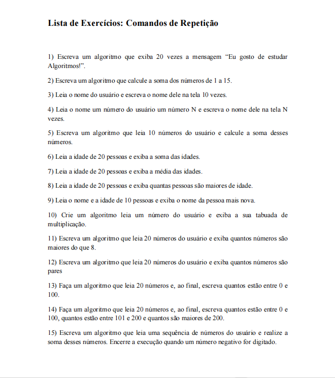

# ☕  Estruturas de Repetição em Java

Repositório contendo exercícios de **estruturas de repetição em Java**, abordando o uso de `for` e `while`.

Os exercícios foram desenvolvidos durante o **3º período do curso de Engenharia de Software na Faculdade de Nova Serrana (FANS)**, na disciplina de **Programação Orientada a Objetos**.

---

## Atividades Propostas

---

## Tecnologias Utilizadas

- Java
- Lógica de programação
- Estruturas de repetição (`for`, `while`)

---

## Objetivo

Praticar a construção de algoritmos utilizando **estruturas de repetição**, fundamentais para o desenvolvimento de sistemas em Java.

---

## Autor

**Matheus Pereira**   
- Estudante de Engenharia de Software Faculdade de Nova Serrana  
- Apaixonado por desenvolvimento desktop  
- GitHub: https://github.com/MatheusPereiira